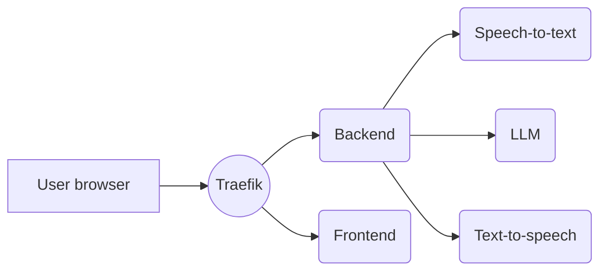
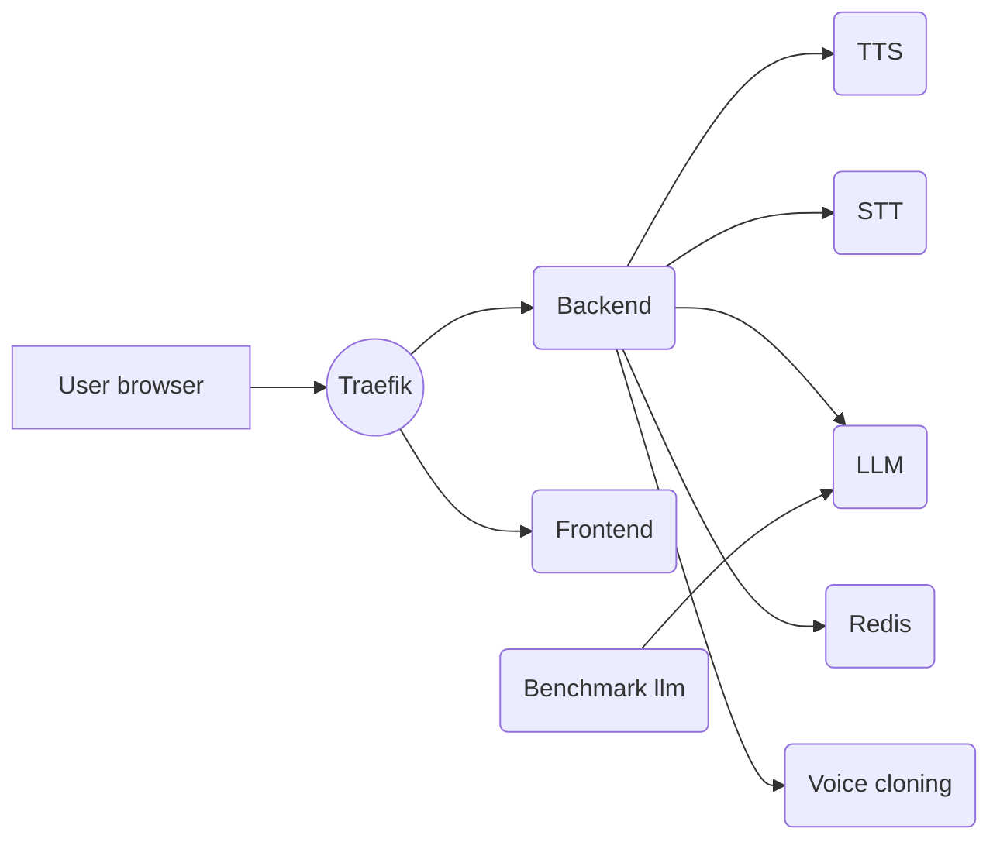
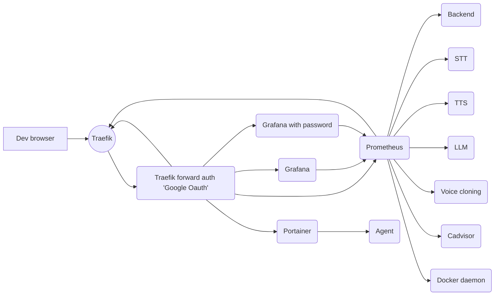

# Unmute

Try it out at [Unmute.sh](https://unmute.sh)!

Unmute is a system that allows text LLMs to listen and speak by wrapping them in Kyutai's Text-to-speech and Speech-to-text models.
The speech-to-text transcribes what the user says, the LLM generates a response in text, and the text-to-speech reads it out loud.
Both the STT and TTS are optimized for low latency and the system works with any text LLM you like.

On a high level, it works like this:



- The user opens the Unmute website, served by the **frontend**.
- By clicking "connect", the user establishes a websocket connection to the **backend**, sending audio and other metadata back and forth in real time.
  - The backend connects via websocket to the **speech-to-text** server, sending it the audio from the user and receiving back the transcription in real time.
  - Once the speech-to-text detects that the user has stopped speaking and it's time to generate a response, the backend connects to an **LLM** server to retrieve the response. We host our own LLM using [VLLM](https://github.com/vllm-project/vllm), but you could also use an external API like OpenAI or Mistral.
  - As the response is being generated, the backend feeds it to the **text-to-speech** server to read it out loud, and forwards the generated speech to the user.
- Traefik routes requests to paths under `/api` to the backend and the rest to the frontend.

## Setup

> [!NOTE]
> If something isn't working for you, don't hesistate to open an issue. We'll do our best to help you figure out what's wrong.

Since Unmute is a complex system with many services that need to be running at the same time, we recommend using [**Docker Compose**](https://docs.docker.com/compose/) to run Unmute.
It allows you to start or stop all services using a single command.
Since the services are Docker containers, you get a reproducible environment without having to worry about dependencies.

### Gemma 3 access

You can use any LLM you want.
By default, Unmute uses [Gemma 3 12B](https://huggingface.co/google/gemma-3-12b-it) as the LLM.
This model is freely available but requires you to accept the conditions to accept it:

1. Create a Hugging Face account.
2. Accept the conditions on the [Gemma model page](https://huggingface.co/google/gemma-3-12b-it).
3. [Create an access token.](https://huggingface.co/docs/hub/en/security-tokens) You can use a fine-grained token, the only permission you need to grant is "Read access to contents of all public gated repos you can access".
4. Add the token into your `~/.bashrc` or equivalent as `export HUGGING_FACE_HUB_TOKEN=hf_...your token here...`

### Start Unmute

On a machine with at least 3 GPUs available, run:

```bash
# Make sure you have the environment variable with the token:
echo $HUGGING_FACE_HUB_TOKEN  # This should print hf_...something...

docker compose -f docker-compose.yml up
```

### Single GPU?

Unmute is meant to be run on multiple GPUs. Running everything (speech-to-text, text-to-speech, and the VLLM server) on the same GPU is possible, but **will result in significantly worse latency**.
If you plan to run on a single GPU, replace `docker-compose.yml` with `docker-compose-single-gpu.yml` in the command above.
That configuration file uses Gemma 3 1B instead of the default 12B, and sets the batch sizes of the STT and TTS lower so that everything fits onto one GPU.

### Running without Docker

Alternatively, you can choose to run Unmute by manually starting the services without going through Docker.
This can be more difficult to set up because of the various dependencies needed.

The following instructions only work for Linux and WSL.

#### Software requirements

* `uv`: Install with `curl -LsSf https://astral.sh/uv/install.sh | sh`
* `cargo`: Install with `curl https://sh.rustup.rs -sSf | sh`
* `nvm`: Install with `curl -o- https://raw.githubusercontent.com/nvm-sh/nvm/v0.40.3/install.sh | bash`
* `cuda 12.1`: Install it with conda or directly from the Nvidia website. Needed for the Rust processes (tts and stt).

#### Hardware requirements

Start each of the services one by one in a different tmux session or terminal:
```bash
./dockerless/start_frontend.sh
./dockerless/start_worker.sh
./dockerless/start_llm.sh        # Needs 6.1GB of vram
./dockerless/start_stt.sh        # Needs 2.5GB of vram
./dockerless/start_tts.sh        # Needs 5.3GB of vram
```
And the website should be accessible at `http://localhost:3000`.

## Modifying Unmute

Here are some high-level pointers about how you'd go about making certain changes to Unmute.

### Changing characters/voices

The characters' voices and prompts are defined in [`voices.yaml`](voices.yaml).
The format of the config file should be intuitive.
Certain system prompts contain dynamically generated elements.
For example, "Quiz show" has its 5 questions randomly chosen in advance from a fixed list.
System prompts like this are defined in [`unmute/llm/system_prompt.py`](unmute/llm/system_prompt.py).

Note that the file is only loaded when the backend starts and is then cached, so if you change something in `voices.yaml`,
you'll need to restart the backend.

### Swapping the frontend

The backend and frontend communicate over websocket using a protocol based on the
[OpenAI Realtime API](https://platform.openai.com/docs/guides/realtime) ("ORA").
Where possible, we try to match the ORA format, but there are some extra messages we needed to add,
and others have simplified parameters.
We try to make it clear where we deviate from the ORA format, see [`unmute/openai_realtime_api_events.py`](unmute/openai_realtime_api_events.py).

Ideally, it should be simple to write a single frontend that can communicate with either the Unmute backend
or the OpenAI Realtime API, but we are not fully compatible yet.
Contributions welcome!

The frontend is a Next.js app defined in `frontend/`.
If you'd like to compare to a different frontend implementation,
there is a Python client defined in
[`unmute/loadtest/loadtest_client.py`](unmute/loadtest/loadtest_client.py),
a script that we use to benchmark the latency and throughput of Unmute.

### Tool calling

This is a common requirement so we would appreciate a contribution to support tool calling in Unmute!

- Look into [how vLLM does tool calling](https://docs.vllm.ai/en/stable/features/tool_calling.html) and modify the vLLM call in `docker-compose.yml` to use approriate arguments.
- On the Unmute side, modify `_generate_response_task()` in [`unmute/unmute_handler.py`](unmute/unmute_handler.py). Currently, `llm.chat_completion()` yields the words one by one.
  This will need to be changed to also allow yielding a tool call, and handling that.

## Production deployment with Docker Swarm

For production deployments like [unmute.sh](https://unmute.sh), we use Docker Swarm rather than Docker Compose.
The two have a similar syntax, but Docker Compose is meant for running on a single machine whereas Docker Swarm scales multiple.

All instructions are to execute from a client machine, and from this repo, not directly on the machine in the swarm.

```bash
# If new machine
scp setup_gpu_swarm_node.py llm-wrapper-gpu000:/root/
ssh llm-wrapper-gpu000 python3 /root/setup_gpu_swarm_node.py

# Manager only, the command to declare it as being a manager. If a swarm is already up, you don't need it.
docker -H ssh://llm-wrapper-gpu000 swarm init

# If you want to connect a new worker to the manager, get the command to run by doing
docker -H ssh://llm-wrapper-gpu000 swarm join-token worker
# and then run the command printed on the worker

# Here onwards you need the following environment variables:
# HUGGING_FACE_HUB_TOKEN:
#   How to generate: https://huggingface.co/docs/hub/en/security-tokens
#   Used to access "gated" models that require accepting terms and conditions.
#   You need access to https://huggingface.co/google/gemma-3-12b-it
# PROVIDERS_GOOGLE_CLIENT_SECRET:
#   How to generate: https://github.com/thomseddon/traefik-forward-auth?tab=readme-ov-file#google
#   Used to require authentication to access the observability services such as Grafana and Traefik.
# NEWSAPI_API_KEY:
#   How to generate: https://newsapi.org/
#   Optional. Used to fetch data for the "Dev (news)" character. If not provided,
#   everything else will still run fine.
./bake_deploy_prod.sh
# or
./bake_deploy_staging.sh
```

If you want to change the docker install directory (that contains images and volumes), change the `/etc/docker/daemon.json` and add:

```
  "data-root": "/new/docker-data"
```

and then restart docker with `service docker restart`

Note that currently, you'll have to scp `/scratch/models` to all nodes of the swarm because we can't use http to read our models/voices.

### Restarting a service
Restart a given service (for example `llm-wrapper_tts` to get new voices when the voice list changes)

```bash
docker -H ssh://llm-wrapper-gpu000 service update --force llm-wrapper_something
```

### Updating a single service
You might not trust a `docker stack deploy` to update only a service that has changed. Notably because the definition
of "changed" is different for humans and for Docker services (copying a .git directory with more branches might be considered
a change, even though it does not change anything to the code). In this case, if you want to update only one service, you can do so without `docker stack deploy` and without `swarm-deploy.yml` by using `docker service update`. Everything that `docker stack deploy` can change on services, `docker service update` can do so too.

For example, you might want to update the docker image of the frontend service with:
```bash
docker service update --image rg.fr-par.scw.cloud/namespace-unruffled-tereshkova/llm-wrapper-frontend:latest --with-registry-auth llm-wrapper_frontend
```
a volume can be added with
```bash
docker service update --mount-add type=volume,source=other-volume,target=/somewhere-else llm-wrapper_frontend
```
etc...

## urls:
* <https://unmute.sh>
* <https://traefik-delicious-burrito.unmute.sh>
* <https://grafana-delicious-burrito.unmute.sh>
* <https://prometheus-delicious-burrito.unmute.sh>
* <https://portainer-delicious-burrito.unmute.sh>

## Other

Run the llm benchmark with

```bash
docker exec -it $(docker ps --format '{{.Names}}' | grep benchmark-llm) bash /run_bench.sh
```


## Swarm services

### Main app



### Monitoring

The production deployment contains additional goodies for monitoring:
- [Prometheus](https://prometheus.io/) to store metrics, e.g. the number of active connections and latency measurements
- [Grafana](https://grafana.com/) to visualize those metrics
- [Portainer](https://www.portainer.io/) for checking the status of the containers



## Developing Unmute

### Install pre-commit hooks

First install `pre-commit` itself – you likely want to install it globally using `pip install pre-commit` rather than in a virtual environment or `uv`,
because you need the `pre-commit` executable to always be available. Then run:

```bash
pre-commit install --hook-type pre-commit
```

We recommend using [uv](https://docs.astral.sh/uv/) to manage Python dependencies.
The commands below assume you are using uv.

### Run backend (dev mode, with autoreloading)

```bash
uv run fastapi dev unmute/main_websocket.py
```

### Run backend (production)

```bash
uv run fastapi run unmute/main_websocket.py
```

### Run loadtest

`loadtest_client.py` is a script that connects to Unmute and simulates conversations with it in order to measure latency and throughput.

```bash
uv run unmute/loadtest/loadtest_client.py --server-url ws://localhost:8000 --n-workers 16
```
