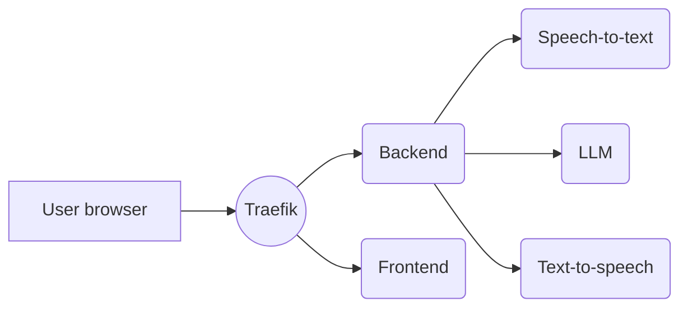

# Unmute

Try it out at [Unmute.sh](https://unmute.sh)!

Unmute is a system that allows text LLMs to listen and speak by wrapping them in Kyutai's Text-to-speech and Speech-to-text models.
The speech-to-text transcribes what the user says, the LLM generates a response in text, and the text-to-speech reads it out loud.
Both the STT and TTS are optimized for low latency and the system works with any text LLM you like.

On a high level, it works like this:



- The user opens the Unmute website, served by the **frontend**.
- By clicking "connect", the user establishes a websocket connection to the **backend**, sending audio and other metadata back and forth in real time.
  - The backend connects via websocket to the **speech-to-text** server, sending it the audio from the user and receiving back the transcription in real time.
  - Once the speech-to-text detects that the user has stopped speaking and it's time to generate a response, the backend connects to an **LLM** server to retrieve the response. We host our own LLM using [VLLM](https://github.com/vllm-project/vllm), but you could also use an external API like OpenAI or Mistral.
  - As the response is being generated, the backend feeds it to the **text-to-speech** server to read it out loud, and forwards the generated speech to the user.
- Traefik routes requests to paths under `/api` to the backend and the rest to the frontend.

## Setup

> [!NOTE]
> If something isn't working for you, don't hesistate to open an issue. We'll do our best to help you figure out what's wrong.

We provide in this repository multiple ways of deploying your own [unmute.sh](unmute.sh):

| Name                      | Number of gpus | Number of machines | Difficulty | Documented | Kyutai support |
|---------------------------|----------------|--------------------|------------|------------|----------------|
| Docker compose            | 1+             | 1                  | Very easy  |✅         |✅              |
| Without Docker            | 1 to 3         | 1 to 5             | Easy       |✅         |✅              |
| Docker swarm              | 1 to ~100      | 1 to ~100          | Medium     |✅         |❌              |


Since Unmute is a complex system with many services that need to be running at the same time, we recommend using [**Docker Compose**](https://docs.docker.com/compose/) to run Unmute.
It allows you to start or stop all services using a single command.
Since the services are Docker containers, you get a reproducible environment without having to worry about dependencies.

While we support deploying with Docker compose and without Docker, the Docker Swarm deployment is only given to show how we deploy and scale [unmute.sh](unmute.sh). It looks a lot like the compose files, but since debugging multi-nodes applications is hard, we cannot help you debug the swarm deployment.

### LLM access on Hugging Face Hub

You can use any LLM you want.
By default, Unmute uses [Mistral Small 3.2 24B](https://huggingface.co/mistralai/Mistral-Small-3.2-24B-Instruct-2506) as the LLM.
([Gemma 3 12B](https://huggingface.co/google/gemma-3-12b-it) is also a good choice.)
This model is freely available but requires you to accept the conditions to accept it:

1. Create a Hugging Face account.
2. Accept the conditions on the [Mistral Small 3.2 24B model page](https://huggingface.co/mistralai/Mistral-Small-3.2-24B-Instruct-2506).
3. [Create an access token.](https://huggingface.co/docs/hub/en/security-tokens) You can use a fine-grained token, the only permission you need to grant is "Read access to contents of all public gated repos you can access".
   **Do not use tokens with write access when deploying publicly.** In case the server is compromised somehow, the attacker would get write access to any models/datasets/etc. you have on Hugging Face.
4. Add the token into your `~/.bashrc` or equivalent as `export HUGGING_FACE_HUB_TOKEN=hf_...your token here...`

### Start Unmute

By default, the configuration files [for the speech-to-text](services/moshi-server/stt.toml)
and [for the text-to-speech](services/moshi-server/tts-py.toml) have a high batch size to allow serving many users simultaneously.
If you're just running Unmute for a single user, go to the two configuration files and change `batch_size` to 2.
Using 2 instead of 1 will prevent issues with hitting the server capacity if you reconnect very quickly.

Open `docker-compose.yml` and look for `NOTE:` comments to see other places that you might need to adjust.

If you use [google/gemma-3-4b-it](https://huggingface.co/google/gemma-3-4b-it),
the default in `docker-compose.yml`, 16GB of GPU memory is sufficient.

On a machine with a GPU, run:

```bash
# Make sure you have the environment variable with the token:
echo $HUGGING_FACE_HUB_TOKEN  # This should print hf_...something...

docker compose -f docker-compose.yml up
```

#### Using multiple GPUs

On [Unmute.sh](https://unmute.sh/), we run the speech-to-text, text-to-speech, and the VLLM server on separate GPUs,
which improves the latency compared to a single-GPU setup.
The TTS latency decreases from ~750ms when running everything on a single L40S GPU to around ~450ms on [Unmute.sh](https://unmute.sh/).

If you have at least three GPUs available, add this snippet to the `stt`, `tts` and `llm` services to ensure they are run on separate GPUs:

```yaml
  stt: # Similarly for `tts` and `llm`
    # ...other configuration
    deploy:
      resources:
        reservations:
          devices:
            - driver: nvidia
              count: 1
              capabilities: [gpu]
```

### Running without Docker

Alternatively, you can choose to run Unmute by manually starting the services without going through Docker.
This can be more difficult to set up because of the various dependencies needed.

The following instructions only work for Linux and WSL.

#### Software requirements

* `uv`: Install with `curl -LsSf https://astral.sh/uv/install.sh | sh`
* `cargo`: Install with `curl https://sh.rustup.rs -sSf | sh`
* `nvm`: Install with `curl -o- https://raw.githubusercontent.com/nvm-sh/nvm/v0.40.3/install.sh | bash`
* `cuda 12.1`: Install it with conda or directly from the Nvidia website. Needed for the Rust processes (tts and stt).

#### Hardware requirements

Start each of the services one by one in a different tmux session or terminal:
```bash
./dockerless/start_frontend.sh
./dockerless/start_backend.sh
./dockerless/start_llm.sh        # Needs 6.1GB of vram
./dockerless/start_stt.sh        # Needs 2.5GB of vram
./dockerless/start_tts.sh        # Needs 5.3GB of vram
```
And the website should be accessible at `http://localhost:3000`.

## Modifying Unmute

Here are some high-level pointers about how you'd go about making certain changes to Unmute.

### Changing characters/voices

The characters' voices and prompts are defined in [`voices.yaml`](voices.yaml).
The format of the config file should be intuitive.
Certain system prompts contain dynamically generated elements.
For example, "Quiz show" has its 5 questions randomly chosen in advance from a fixed list.
System prompts like this are defined in [`unmute/llm/system_prompt.py`](unmute/llm/system_prompt.py).

Note that the file is only loaded when the backend starts and is then cached, so if you change something in `voices.yaml`,
you'll need to restart the backend.

### Swapping the frontend

The backend and frontend communicate over websocket using a protocol based on the
[OpenAI Realtime API](https://platform.openai.com/docs/guides/realtime) ("ORA").
Where possible, we try to match the ORA format, but there are some extra messages we needed to add,
and others have simplified parameters.
We try to make it clear where we deviate from the ORA format, see [`unmute/openai_realtime_api_events.py`](unmute/openai_realtime_api_events.py).

For detailed information about the WebSocket communication protocol, message types, and audio processing pipeline, see the [browser-backend communication documentation](docs/browser_backend_communication.md).

Ideally, it should be simple to write a single frontend that can communicate with either the Unmute backend
or the OpenAI Realtime API, but we are not fully compatible yet.
Contributions welcome!

The frontend is a Next.js app defined in `frontend/`.
If you'd like to compare to a different frontend implementation,
there is a Python client defined in
[`unmute/loadtest/loadtest_client.py`](unmute/loadtest/loadtest_client.py),
a script that we use to benchmark the latency and throughput of Unmute.

### Tool calling

This is a common requirement so we would appreciate a contribution to support tool calling in Unmute!

- Look into [how vLLM does tool calling](https://docs.vllm.ai/en/stable/features/tool_calling.html) and modify the vLLM call in `docker-compose.yml` to use approriate arguments.
- On the Unmute side, modify `_generate_response_task()` in [`unmute/unmute_handler.py`](unmute/unmute_handler.py). Currently, `llm.chat_completion()` yields the words one by one.
  This will need to be changed to also allow yielding a tool call, and handling that.

## Production deployment with Docker Swarm

If you're curious to know how we deploy and scale [unmute.sh](https://unmute.sh), take a look at our docs
on the [swarm deployments](./SWARM.md).


## Developing Unmute

### Install pre-commit hooks

First install `pre-commit` itself – you likely want to install it globally using `pip install pre-commit` rather than in a virtual environment or `uv`,
because you need the `pre-commit` executable to always be available. Then run:

```bash
pre-commit install --hook-type pre-commit
```

We recommend using [uv](https://docs.astral.sh/uv/) to manage Python dependencies.
The commands below assume you are using uv.

### Run backend (dev mode, with autoreloading)

```bash
uv run fastapi dev unmute/main_websocket.py
```

### Run backend (production)

```bash
uv run fastapi run unmute/main_websocket.py
```

### Run loadtest

`loadtest_client.py` is a script that connects to Unmute and simulates conversations with it in order to measure latency and throughput.

```bash
uv run unmute/loadtest/loadtest_client.py --server-url ws://localhost:8000 --n-workers 16
```
