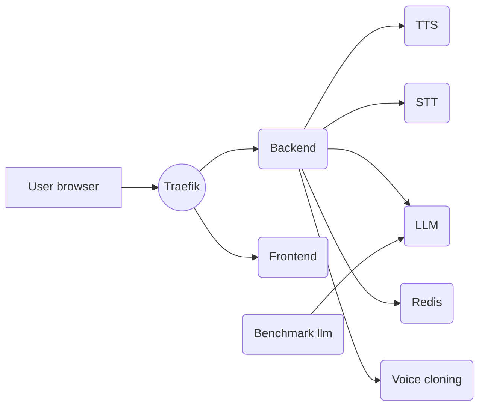
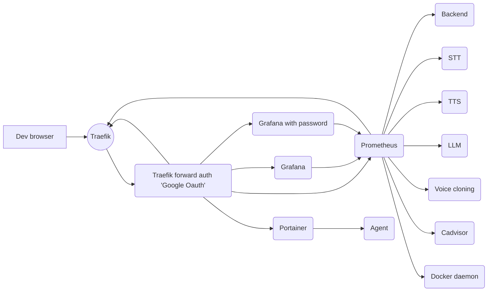

# Swarm deployment

For production deployments like [unmute.sh](https://unmute.sh), we use Docker Swarm rather than Docker Compose.
The two have a similar syntax, but Docker Compose is meant for running on a single machine whereas Docker Swarm scales multiple. You can think of Docker Swarm as "Multi-node Docker Compose".

The [swarm config file](./swarm-deploy.yml) is well-documented. Feel free to read it to better understand how the stack works. The [Docker swarm docs](https://docs.docker.com/engine/swarm/) are also a good read.

All instructions are to be executed from a client machine, and from this repo, not directly on the machine in the swarm.

```bash
# If new machine
scp setup_gpu_swarm_node.py llm-wrapper-gpu000:/root/
ssh llm-wrapper-gpu000 python3 /root/setup_gpu_swarm_node.py

# Manager only, the command to declare it as being a manager. If a swarm is already up, you don't need it.
docker -H ssh://llm-wrapper-gpu000 swarm init

# If you want to connect a new worker to the manager, get the command to run by doing
docker -H ssh://llm-wrapper-gpu000 swarm join-token worker
# and then run the command printed on the worker

# Here onwards you need the following environment variables:
# HUGGING_FACE_HUB_TOKEN:
#   How to generate: https://huggingface.co/docs/hub/en/security-tokens
#   Used to access "gated" models that require accepting terms and conditions.
#   You need access to https://huggingface.co/mistralai/Mistral-Small-24B-Instruct-2501
# PROVIDERS_GOOGLE_CLIENT_SECRET:
#   How to generate: https://github.com/thomseddon/traefik-forward-auth?tab=readme-ov-file#google
#   Used to require authentication to access the observability services such as Grafana and Traefik.
# NEWSAPI_API_KEY:
#   How to generate: https://newsapi.org/
#   Optional. Used to fetch data for the "Dev (news)" character. If not provided,
#   everything else will still run fine.
./bake_deploy_prod.sh
# or
./bake_deploy_staging.sh
```

If you want to change the docker install directory (that contains images and volumes), change the `/etc/docker/daemon.json` and add:

```
  "data-root": "/new/docker-data"
```

and then restart docker with `service docker restart`

### Scaling the swarm

If you have heavy load and want more resources (gpu/disk/ram/cpu) in your swarm, there are two steps:
1) Add new machines to the swarm. For this, go to the manager and run `docker swarm join-token worker`. It will give you the command to run on the new node to join the swarm.
2) Once the new node has joined the swarm, increase the number of containers for the services you want to scale. For example `docker service scale llm-wrapper_llm=10`.

Note that swarm will not kill containers and restart them on another node without manual input to avoid downtime. This means that if you want rebalance all the containers of a services across all nodes, you can just force-restart the service.

### Restarting a service
Restart a given service (for example `llm-wrapper_tts` to get new voices when the voice list changes)

```bash
docker -H ssh://llm-wrapper-gpu000 service update --force llm-wrapper_something
```

### Updating a single service
You might not trust a `docker stack deploy` to update only a service that has changed. Notably because the definition
of "changed" is different for humans and for Docker services (copying a .git directory with more branches might be considered
a change, even though it does not change anything to the code). In this case, if you want to update only one service, you can do so without `docker stack deploy` and without `swarm-deploy.yml` by using `docker service update`. Everything that `docker stack deploy` can change on services, `docker service update` can do so too.

For example, you might want to update the docker image of the frontend service with:
```bash
docker service update --image rg.fr-par.scw.cloud/namespace-unruffled-tereshkova/llm-wrapper-frontend:latest --with-registry-auth llm-wrapper_frontend
```
a volume can be added with
```bash
docker service update --mount-add type=volume,source=other-volume,target=/somewhere-else llm-wrapper_frontend
```
etc...

## urls:
* <https://unmute.sh>
* <https://traefik.unmute.sh>
* <https://grafana.unmute.sh>
* <https://prometheus.unmute.sh>
* <https://portainer.unmute.sh>

## Other

Run the llm benchmark with

```bash
docker exec -it $(docker ps --format '{{.Names}}' | grep benchmark-llm) bash /run_bench.sh
```


## Swarm services

### Main app



### Monitoring

The production deployment contains additional goodies for monitoring:
- [Prometheus](https://prometheus.io/) to store metrics, e.g. the number of active connections and latency measurements
- [Grafana](https://grafana.com/) to visualize those metrics
- [Portainer](https://www.portainer.io/) for checking the status of the containers

